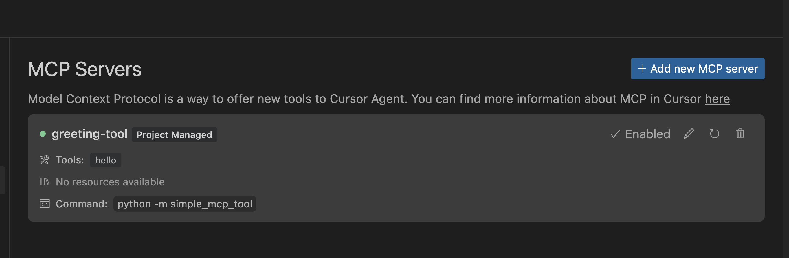

# MCP (Model Context Protocol) Learning Resources

This directory contains examples, tutorials, and resources for understanding and implementing MCP (Model Context Protocol) servers.

## What is MCP?

Model Context Protocol (MCP) is a standardized communication protocol that allows AI models to interact with external tools and services. It provides a consistent way for AI systems like Cursor to discover and utilize capabilities beyond their built-in functions.

MCP is based on JSON-RPC 2.0 and enables AI systems to:
- Discover available tools and their capabilities
- Call external tools with specific parameters
- Receive results back in a consistent format

Unlike proprietary function calling implementations, MCP provides an open standard that can work across multiple AI platforms and tools.

### Current Support Status in Cursor

- **Tools**: ✅ Fully supported - Cursor can execute tools offered by MCP servers
- **Resources**: ❌ Not yet supported - Resource functionality is planned for future releases

> **Important**: When designing MCP servers for Cursor, focus exclusively on implementing tools since resources cannot be accessed by Cursor at this time.

## Core Concepts

### MCP vs. Function Calling

While similar in concept to function calling (as implemented by companies like OpenAI and Anthropic), MCP offers several advantages:
- **Standardization**: A common protocol independent of any single vendor
- **Interoperability**: Tools built for MCP can work with any MCP-compatible AI
- **Discovery**: Built-in mechanisms for tools to advertise their capabilities
- **Future-proofing**: Protection against vendor-specific changes or limitations

## Architecture

### MCP Server Lifecycle

1. **Registration**: MCP servers are registered in the Cursor settings via `mcp.json` configuration
2. **Initialization**: When enabled, Cursor spawns the server as a subprocess
3. **Connection**: Cursor maintains an ongoing connection with the server
4. **Communication**: The AI model sends requests to the server via JSON-RPC 2.0
5. **Termination**: The server runs until disabled in settings or until Cursor closes

### Communication Flow

1. AI model determines it needs an external tool
2. It connects to the MCP server using `mcp.server_info` to discover available tools
3. It sends a request to the appropriate tool using `mcp.tool_call`
4. The server processes the request and returns a response
5. The AI model incorporates the response into its reasoning

## Implementation Details

### Protocol Specification

MCP uses JSON-RPC 2.0 with two primary methods:

#### `mcp.server_info`
- Returns metadata about the server and available tools
- No parameters required
- Response includes tool names, descriptions, and parameter schemas

#### `mcp.tool_call`
- Calls a specific tool with parameters
- Requires `name` (tool to call) and `parameters` (tool-specific parameters)
- Returns results in a standardized format

### Server Requirements

MCP servers must:
1. Accept JSON-RPC 2.0 requests via stdio or other specified channels
2. Implement the required methods (`mcp.server_info` and `mcp.tool_call`)
3. Stay running for the duration of the session (persistence)
4. Properly handle errors according to JSON-RPC 2.0 specifications

### Implementation Approaches

#### Manual Implementation
- **Benefits**:
  - Educational value - shows exactly how the protocol works
  - No dependencies beyond standard Python libraries
  - Simple to understand for beginners
- **Drawbacks**:
  - Must handle low-level protocol details manually
  - More potential for errors and edge cases
  - Limited features without significant additional coding

#### Using Official SDK
- **Benefits**:
  - Handles protocol details automatically
  - Type safety and validation with Pydantic models
  - Rich feature set with minimal code
  - Actively maintained by the MCP team
  - Decorator-based API (`@app.call_tool()`, `@app.list_tools()`) simplifies implementation
  - Built-in support for both stdio and SSE transport methods
- **Drawbacks**:
  - Additional dependency
  - More abstraction (hides some protocol details)
  - Potential for rabbit-hole exploration with numerous features

### Recommended Project Structure

When building an MCP server, follow Python best practices with this structure:

```
my_mcp_tool/
├── pyproject.toml         # Package metadata and dependencies
├── README.md              # Documentation
└── my_mcp_tool/           # Actual package code
    ├── __init__.py        # Package marker
    ├── __main__.py        # Entry point
    └── server.py          # Server implementation
```

### Critical Components

When implementing an MCP server with the SDK:

1. **Server Instance** - Created with `Server("server-name")` from `mcp.server.lowlevel`
2. **Tool Registration** - Tools must be registered using the `@app.list_tools()` decorator
3. **Tool Implementation** - Tool handlers are implemented with the `@app.call_tool()` decorator
4. **Transport Setup** - Configure transport method (stdio/SSE)
5. **Content Types** - Use SDK-provided content types like `types.TextContent` for responses

## Practical Considerations

### Performance

- **Persistent Connection**: MCP servers stay running to avoid startup overhead
- **Multiple Requests**: A single server instance handles multiple requests over time
- **Resource Management**: Servers should manage their resources efficiently
- **Async Operations**: Leverage asyncio for non-blocking operations in tool handlers
- **Response Time**: Tools should respond quickly or provide progress updates for long operations

### Error Handling

Proper error handling is essential:
- Format errors according to JSON-RPC 2.0 specification
- Provide meaningful error messages
- Handle unexpected inputs gracefully
- Implement robust logging for debugging
- Use the SDK's error handling capabilities to automatically convert exceptions to protocol responses

### Security

When implementing MCP servers, consider:
- Input validation to prevent injection attacks
- Careful handling of file system access
- Appropriate permission models for tools
- Rate limiting for resource-intensive operations
- Authentication mechanisms for sensitive tools (for future implementations)

### Best Practices

1. **Clean API Design** - Design tools with clear, specific functionality and well-documented schemas
2. **Error Handling** - Implement thorough error handling in tool implementations
3. **Logging** - Use structured logging to track server operation and tool usage
4. **Testing** - Create comprehensive tests for each tool to ensure reliability
5. **Documentation** - Document tools thoroughly, including examples of usage
6. **Version Management** - Use semantic versioning for your MCP server

## Available Examples

### Python

The `simple_mcp_tool` directory contains a basic "Hello World" implementation of an MCP server in Python. It's designed for clarity and ease of learning, with comprehensive documentation and debugging support.

```python
#!/usr/bin/env python3
import json
import sys
import traceback

# Define the server specification with one simple tool
SERVER_SPEC = {
    "name": "hello-world-mcp-python",
    "version": "1.0.0",
    "tools": [
        {
            "name": "hello",
            "description": "A simple greeting tool",
            "parameters": {
                "type": "object",
                "properties": {
                    "name": {
                        "type": "string",
                        "description": "The name to greet"
                    }
                },
                "required": ["name"]
            }
        }
    ]
}

def debug_log(message):
    """Write debug messages to stderr"""
    print(f"[DEBUG] {message}", file=sys.stderr, flush=True)

def create_error_response(request_id, code, message):
    """Create a JSON-RPC error response"""
    return {
        "jsonrpc": "2.0",
        "id": request_id,
        "error": {
            "code": code,
            "message": message
        }
    }

def handle_server_info(request):
    """Handle mcp.server_info requests"""
    debug_log("Handling mcp.server_info request")
    return {
        "jsonrpc": "2.0",
        "id": request.get("id"),
        "result": SERVER_SPEC
    }

def handle_tool_call(request):
    """Handle mcp.tool_call requests"""
    debug_log("Handling mcp.tool_call request")
    
    params = request.get("params", {})
    tool_name = params.get("name")
    parameters = params.get("parameters", {})
    
    debug_log(f"Tool call: {tool_name} with parameters: {parameters}")
    
    if tool_name == "hello":
        name = parameters.get("name", "there")
        return {
            "jsonrpc": "2.0",
            "id": request.get("id"),
            "result": {
                "content": f"Hello, {name}! How are you today?"
            }
        }
    else:
        return create_error_response(
            request.get("id"), 
            -32601, 
            f"Unknown tool: {tool_name}"
        )

def main():
    """Main entry point for the MCP server"""
    debug_log("MCP Server starting...")
    
    # Process input continuously
    while True:
        try:
            # Read input line
            line = sys.stdin.readline()
            
            # Handle empty line or end of input
            if not line:
                debug_log("No more input, waiting...")
                import time
                time.sleep(0.1)
                continue
                
            # Process the request
            try:
                request = json.loads(line)
                
                # Process the request based on method
                if request.get("jsonrpc") == "2.0":
                    method = request.get("method")
                    
                    if method == "mcp.server_info":
                        response = handle_server_info(request)
                    elif method == "mcp.tool_call":
                        response = handle_tool_call(request)
                    else:
                        response = create_error_response(
                            request.get("id"), 
                            -32601, 
                            f"Method not found: {method}"
                        )
                else:
                    response = create_error_response(
                        request.get("id"), 
                        -32600, 
                        "Invalid request: Not a valid JSON-RPC 2.0 request"
                    )
                
                # Send the response
                print(json.dumps(response), flush=True)
                
            except json.JSONDecodeError:
                # Invalid JSON
                debug_log("Invalid JSON received")
                error_response = create_error_response(
                    None, 
                    -32700, 
                    "Parse error: Invalid JSON"
                )
                print(json.dumps(error_response), flush=True)
                
        except Exception as e:
            debug_log(f"Error processing request: {str(e)}")
            debug_log(traceback.format_exc())
            
            error_response = create_error_response(
                None, 
                -32700, 
                f"Parse error: {str(e)}"
            )
            print(json.dumps(error_response), flush=True)

if __name__ == "__main__":
    main()
```

## Troubleshooting and Best Practices

### Common Issues

- **No Response from Server**: Check stdin/stdout handling and make sure `flush=True` is set
- **Tool Not Found**: Verify tool names match exactly between server definition and tool call
- **Parameter Errors**: Ensure required parameters are provided and types match schema
- **Server Termination**: Handle exceptions properly to prevent unexpected termination
- **Initialization Problems**: Most issues occur during the initialization phase of the protocol
- **Message Format Errors**: Incorrect JSON formatting can cause silent failures
- **Transport Mismatch**: Ensure the transport method matches what Cursor expects
- **Missing Dependencies**: Ensure all required packages are properly installed

### Debugging Strategies

- **Verbose Logging**: Add detailed logging at different stages to trace issues
- **Test Client**: Create a test client that simulates Cursor's requests for verification
- **Proper Error Messages**: Use clear error messages in tool handlers to improve troubleshooting
- **Development Mode**: Start with stdio transport for simpler development before moving to more complex transports
- **Cursor Output Panel**: Check Cursor's Output Panel for error messages about the MCP server's activity

### Configuration Issues

#### Path Resolution in mcp.json

- **Variable Path Issues**: Using `${workspaceRoot}` in `mcp.json` may not be correctly resolved by Cursor
- **Solution**: Use direct relative paths starting with `./` instead of variables

```json
// Doesn't work reliably
{
  "mcpServers": {
    "python-hello": {
      "command": "python3",
      "args": [
        "${workspaceRoot}/examples/python/hello_server.py"
      ]
    }
  }
}

// Works better
{
  "mcpServers": {
    "python-hello": {
      "command": "python",
      "args": [
        "./examples/python/hello_server.py"
      ]
    }
  }
}
```

#### Absolute vs Relative Paths
- For project-specific MCP configurations, use relative paths with the `./` prefix
- Absolute paths might work differently than relative paths in the configuration

### Server Communication Issues

#### Client Connection Problems
- **"Client closed" error**: This often indicates the MCP server starts but then terminates unexpectedly
- **Potential causes**:
  1. Script not handling stdin/stdout communication properly
  2. Script exiting after initialization instead of staying alive
  3. Missing or incorrect "ready" signal
  4. Error in the script causing early termination
- **Solutions**:
  - Ensure script has an infinite loop to continuously read from stdin
  - Check for proper error handling in JSON parsing
  - Validate that method names match what Cursor expects

#### Protocol Mismatch
- If your server implements `list_tools` and `call_tool` methods (older names), update to the current protocol:
  - Change `list_tools` to `mcp.server_info`
  - Change `call_tool` to `mcp.tool_call`
  - Update response formats to match the expected protocol

### Docker-Related Issues

If running MCP servers in Docker containers:
- Use the `-i` flag for interactive mode to properly handle stdin/stdout
- Ensure the container doesn't terminate prematurely
- Check that stdio communication is properly forwarded

### Language Comparison for MCP Servers

When choosing a language for implementing MCP servers, consider these factors:

**Python Advantages**:
- Readability and simplicity
- Strong data processing capabilities
- Better suited for data manipulation tasks
- Excellent for rapid prototyping

**Node.js Advantages**:
- Native JSON handling
- Event-driven architecture suited for I/O operations
- Typically faster startup time
- Rich ecosystem for network operations

For most MCP implementations, either language works well, with the choice often coming down to team expertise and specific project requirements.

## Running the Examples



1. Navigate to the example directory (e.g., `simple_mcp_tool`)
2. Make the server executable: `chmod +x hello_server.py`
3. Create a `.cursor` directory in your project (if it doesn't exist): `mkdir -p .cursor`
4. Copy the mcp.json file to the `.cursor` directory: `cp mcp.json .cursor/`
5. In Cursor settings, toggle the MCP server from "Disabled" to "Enabled" to activate it
6. In the Cursor chat, ask Claude: "Use the hello tool with the name 'World'"

## Future Directions

1. **Resource Implementation**: Prepare for future Cursor support of MCP resources
2. **Multi-Tool Integration**: Develop strategies for implementing multiple tools in a single server
3. **Authentication**: Consider authentication mechanisms for sensitive tools
4. **Metrics Collection**: Track tool usage and performance for valuable insights

## Further Resources

- [Model Context Protocol Documentation](https://modelcontextprotocol.github.io/)
- [JSON-RPC 2.0 Specification](https://www.jsonrpc.org/specification)
- [Cursor MCP Documentation](https://docs.cursor.com/context/model-context-protocol)
- [Official MCP SDK](https://github.com/modelcontextprotocol/python-sdk)

## Additional Guides in This Repository

This learning directory includes comprehensive guides to help you master MCP implementation:

### [SDK Guide](SDK-GUIDE.md)

A step-by-step guide to using the official MCP SDK, including:
- Complete code examples
- Best practices for tool implementation
- Error handling strategies
- Performance optimization tips
- Cursor integration details

### [Troubleshooting Guide](TROUBLESHOOTING.md)

Practical solutions to common MCP implementation issues:
- Debug logging techniques
- Connection problems
- Tool discovery issues
- Error message interpretation
- Empirical insights from real-world implementations 