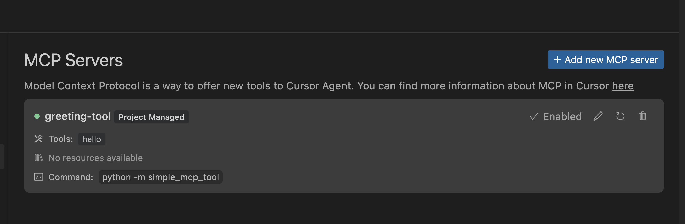

# Simple MCP Tool



A basic implementation of an MCP server using the official Python SDK with stdio transport.

## Features

- Simple greeting tool that responds with a personalized message
- Uses stdio transport for communication with Cursor
- Demonstrates the core concepts of the MCP protocol

## Usage

Install the package in development mode:

```bash
cd /path/to/simple_mcp_tool
pip install -e .
```

Run the server:

```bash
simple-mcp-tool
```

## Cursor Integration

Configure Cursor to use this tool by creating a `.cursor/mcp.json` file in your project directory:

```json
{
  "version": 1,
  "mcpServers": {
    "greeting-tool": {
      "command": "python",
      "args": [
        "-m",
        "simple_mcp_tool"
      ]
    }
  }
}
```

Then, you can use the greeting tool in Cursor by referencing it in your prompts: "use the hello tool."